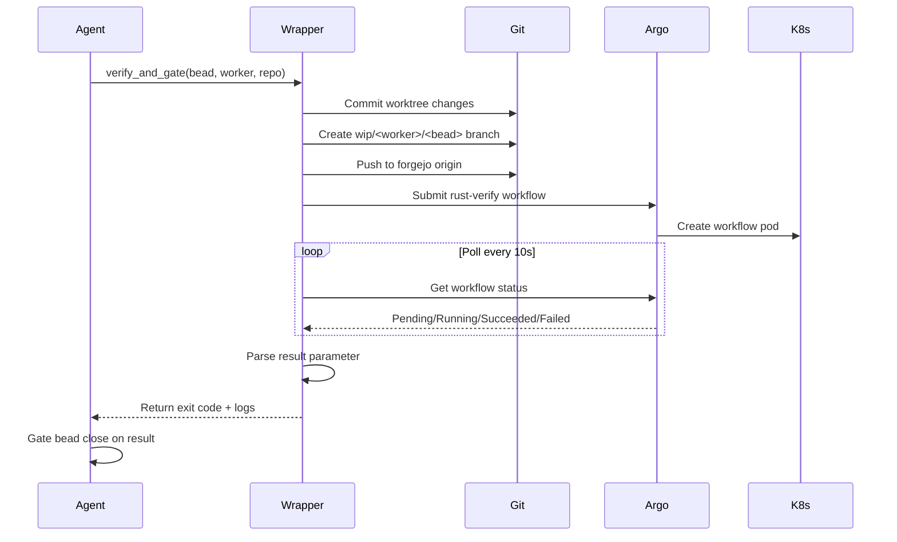

# NEEDLE Per-Bead Verify Wrapper

This directory contains the NEEDLE per-bead verification wrapper that integrates NEEDLE workers with the `rust-verify` Argo WorkflowTemplate on iad-ci.

## Overview

The wrapper provides a complete workflow for verifying bead work:

1. **Commit & Push**: Commits the worker's worktree changes to a `wip/<worker>/<bead>` branch
2. **Submit Workflow**: Submits the `rust-verify` WorkflowTemplate with repo/revision/test-args
3. **Poll to Completion**: Monitors the workflow until it completes (or times out)
4. **Return Results**: Returns exit code and full logs to the agent
5. **Gate Close**: Blocks bead close on verification failure

## Components

### 1. `needle-verify-wrapper.sh`

Bash script that handles the complete verification workflow.

**Usage:**
```bash
./needle-verify-wrapper.sh <bead-id> <worker-name> <repo-path> [test-args]
```

**Example:**
```bash
./needle-verify-wrapper.sh \
  bf-4st8y \
  claude-code-glm-4.7 \
  /home/coding/pdftract \
  "-p pdftract-core --lib"
```

**Environment Variables:**
- `KUBECONFIG`: Path to kubectl config (default: `~/.kube/iad-ci.kubeconfig`)
- `DRY_RUN`: Set to `true` to skip workflow submission (for testing)

**Exit Codes:**
- `0`: Verification passed
- `1`: Verification failed (or workflow error)

### 2. `needle_verify.py`

Python helper module providing a programmatic interface.

**Usage:**
```python
from needle_verify import verify_and_gate

# Gate bead close on verification result
if not verify_and_gate(
    bead_id="bf-4st8y",
    worker_name="claude-code-glm-4.7",
    repo_path="/home/coding/pdftract",
    test_args="-p pdftract-core --lib"
):
    sys.exit(1)  # Block bead close
```

**Advanced Usage:**
```python
from needle_verify import NeedleVerifier, VerificationError

verifier = NeedleVerifier(
    bead_id="bf-4st8y",
    worker_name="claude-code-glm-4.7",
    repo_path="/home/coding/pdftract"
)

try:
    result = verifier.run(test_args="-p pdftract-core --lib")
    
    if result.passed:
        print(f"✓ Verification passed")
        print(f"  Workflow: {result.workflow_name}")
        print(f"  Output:\n{result.output}")
    else:
        print(f"✗ Verification failed")
        print(f"  Exit code: {result.exit_code}")
        
except VerificationError as e:
    print(f"Verification error: {e}")
```

## Workflow Details

### Branch Naming

Branches follow the pattern: `wip/<worker-name>/<bead-id>`

Examples:
- `wip/claude-code-glm-4.7/bf-4st8y`
- `wip/roam5/bf-4abc`

### WorkflowTemplate

The wrapper submits workflows using the `rust-verify` WorkflowTemplate from `declarative-config`:

```yaml
workflowTemplateRef:
  name: rust-verify
arguments:
  parameters:
    - name: repo
      value: "https://git.ardenone.com/jedarden/pdftract.git"
    - name: revision
      value: "refs/heads/wip/claude-code-glm-4.7/bf-4st8y"
    - name: test-args
      value: "-p pdftract-core --lib"
```

### Workflow Execution

The `rust-verify` WorkflowTemplate:

1. **Clone**: Clones the repo at the specified revision (wip branch)
2. **Build**: Runs `cargo check --all-targets` (fast fail)
3. **Lint**: Runs `cargo clippy --all-targets -- -D warnings`
4. **Test**: Runs `cargo test $TEST_ARGS`
5. **Output**: Returns `result` (pass/fail) and `output` (full logs)

### Polling

The wrapper polls the workflow every 10 seconds for up to 30 minutes (configurable).

Workflow statuses:
- `Pending` → `Running` → `Succeeded` | `Failed` | `Error`

## Integration with NEEDLE Workers

### Worker Lifecycle



### Example Worker Integration

```python
import sys
from needle_verify import verify_and_gate

def main():
    bead_id = "bf-4st8y"
    worker_name = "claude-code-glm-4.7"
    repo_path = "/home/coding/pdftract"

    # ... implement bead logic ...

    # Verify before closing
    print("Running verification...")
    if not verify_and_gate(
        bead_id=bead_id,
        worker_name=worker_name,
        repo_path=repo_path,
        test_args=""  # Run all tests
    ):
        print("Verification failed - blocking bead close")
        sys.exit(1)

    print("Verification passed - closing bead")
    # ... close bead ...

if __name__ == "__main__":
    main()
```

## Error Handling

### Wrapper Errors

- **Clone failures**: Git repository inaccessible
- **Push failures**: Network/permission issues with forgejo
- **Workflow submission**: kubectl/K8s errors
- **Workflow timeout**: Verification did not complete within 30 minutes

### Verification Failures

- **cargo check**: Compilation errors
- **cargo clippy**: Lint warnings (treated as errors)
- **cargo test**: Test failures

### Cleanup

The wrapper automatically cleans up the wip branch on both success and failure:

```bash
git checkout main
git branch -D "wip/<worker>/<bead>"
```

## Testing

### Dry Run Mode

Test the wrapper without submitting a workflow:

```bash
DRY_RUN=true ./needle-verify-wrapper.sh \
  bf-4st8y \
  claude-code-glm-4.7 \
  /home/coding/pdftract
```

This will:
1. Create the wip branch
2. Generate the workflow manifest
3. Print the manifest
4. Clean up the branch
5. Exit (no workflow submitted)

### Local Testing

Test the Python helper locally:

```bash
cd /home/coding/pdftract/.cli
python3 needle_verify.py bf-4st8y claude-code-glm-4.7 /home/coding/pdftract
```

## Troubleshooting

### Workflow Not Found

**Error**: `workflowtemplates.argoproj.io "rust-verify" not found`

**Solution**: Ensure the `rust-verify` WorkflowTemplate exists in `declarative-config`:
```bash
kubectl --kubeconfig=~/.kube/iad-ci.kubeconfig \
  get workflowtemplate rust-verify -n argo-workflows
```

### Permission Denied

**Error**: `error: You must be logged in to the server`

**Solution**: Check kubeconfig credentials:
```bash
kubectl --kubeconfig=~/.kube/iad-ci.kubeconfig get nodes
```

### Branch Push Fails

**Error**: `error: failed to push some refs`

**Solution**:
1. Check forgejo authentication: `git config remote.origin.url`
2. Ensure forgejo token is configured in git credentials
3. Delete existing wip branch: `git push origin --delete wip/<worker>/<bead>`

### Workflow Timeout

**Error**: `Workflow did not complete within 1800s`

**Solution**:
1. Check workflow logs: `kubectl logs -n argo-workflows <pod-name>`
2. Check workflow status: `kubectl get workflow <workflow-name> -n argo-workflows -o yaml`
3. Increase timeout in wrapper script if needed

## Architecture

### Design Decisions

1. **Bash Wrapper**: Handles all kubectl/git operations (more portable than Python)
2. **Python Helper**: Provides programmatic interface for NEEDLE workers
3. **Branch per Bead**: Isolates each bead's changes for independent verification
4. **Forgejo Origin**: Pushes to forgejo (source of truth), not github mirror
5. **Polling Pattern**: Simple polling instead of complex callback mechanism
6. **Automatic Cleanup**: Removes wip branches after verification

### Future Enhancements

- [ ] Support for parallel verification (multiple beads at once)
- [ ] Webhook callback pattern instead of polling
- [ ] Workflow result caching
- [ ] Integration with `bf close` for automatic gating
- [ ] Support for custom WorkflowTemplates (e.g., fuzz, benchmarks)

## References

- **rust-verify WorkflowTemplate**: `~/declarative-config/k8s/iad-ci/argo-workflows/rust-verify-workflowtemplate.yml`
- **pdftract-ci Workflow**: `.ci/argo-workflows/pdftract-ci.yaml`
- **Argo Workflows Documentation**: https://argoproj.github.io/argo-workflows/
- **NEEDLE Worker Docs**: `/home/coding/pdftract/.marathon/instruction.md`

## License

Same as pdftract project (MIT/Apache-2.0).
